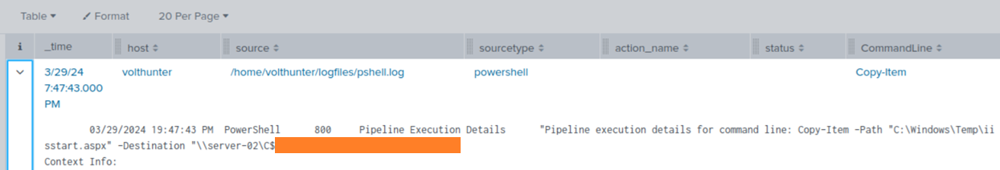
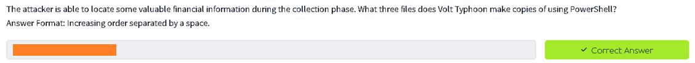
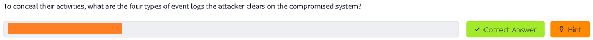

# **Volt Typhoon Write-up**

https://tryhackme.com/room/volttyphoon

I had never used Splunk before, but I figured it out quickly as it is just a UI for querying indexed logs, similar to tools like Kibana and Grafana.

# Task 1 IR Scenario

**Scenario:** The SOC has detected suspicious activity indicative of an advanced persistent threat (APT) group known as Volt Typhoon, notorious for targeting high-value organizations. Assume the role of a security analyst and investigate the intrusion by retracing the attacker's steps.

You have been provided with various log types from a two-week time frame during which the suspected attack occurred. Your ability to research the suspected APT and understand how they maneuver through targeted networks will prove to be just as important as your Splunk skills.

Answer (No answer needed)

# Task 2 Initial Access

Volt Typhoon often gains initial access to target networks by exploiting vulnerabilities in enterprise software. In recent incidents, Volt Typhoon has been observed leveraging vulnerabilities in Zoho ManageEngine ADSelfService Plus, a popular self-service password management solution used by organizations.

## Comb through the ADSelfService Plus logs to begin retracing the attacker’s steps. At what time (ISO 8601 format) was Dean's password changed and their account taken over by the attacker?

**Notice:** Keywords such as ADSelfService Plus and Dean’s password change. Let's first understand how Splunk works.

Splunk has a Search option and Indexes, similar to tools like Kibana and Grafana. It is essentially a UI for querying indexed logs.

By examining Event Count and Type Events, I identified the relevant index to query.

Querying the index was straightforward. I used `index=<index>` and set the time range to **All time** since many records were older. I also used **Verbose mode** to ensure comprehensive results.

Now that I figured how Splunk works let’s get into filtering, first make a filter to easily view the data I need, I also found the sourcetype for ADServiceDesk Plus is: **adss**
So I just add `sourcetype=adss` to the filter than I always prefer Table views in these kinds of applications and add columns that allow me to see what’s happening, quickly.

To find the answer, I filtered the logs for **Password Change** and **Dean**. This revealed two actions: one failed and one successful. The **successful** action is the answer.

Splunk uses ISO 8601 format, making it easy to copy and paste the timestamp.

Answer

## Shortly after Dean's account was compromised, the attacker created a new administrator account. What is the name of the new account that was created?

Finding the new administrator account was straightforward. I used two methods:

1. Filtered the data around the date of the Password Change action to find a newly created username.

2. Looked for a rarely used username in the fields.

Answer

# Task 3 Execution

Volt Typhoon is known to exploit Windows Management Instrumentation Command-line (WMIC) for a range of execution techniques. They leverage WMIC for tasks such as gathering information and dumping valuable databases, allowing them to infiltrate and exploit target networks. By using "living off the land" binaries (LOLBins), they blend in with legitimate system activity, making detection more challenging.

## In an information gathering attempt, what command does the attacker run to find information about local drives on server01 & server02?

With an understanding of Splunk, I searched for commands using WMIC and server02, as mentioned in the task.

I found the attacker using the WMIC command to gather information about local drives on server01 and server02. The command is the answer.

Answer

## The attacker uses ntdsutil to create a copy of the AD database. After moving the file to a web server, the attacker compresses the database. What password does the attacker set on the archive?

I filtered the logs using the keyword `ntdsutil` to find the creation of the AD database dump file.

Although the initial filter did not provide the answer, it showed the creation of the AD database dump file. I then filtered the logs to find the command used to archive the file, revealing the password set by the attacker.

Answer

# Task 4 Persistence

Our target APT frequently employs web shells as a persistence mechanism to maintain a foothold. They disguise these web shells as legitimate files, enabling remote control over the server and allowing them to execute commands undetected.

## To establish persistence on the compromised server, the attacker created a web shell using base64 encoded text. In which directory was the web shell placed?

There are multiple ways to find this answer. I filtered PowerShell commands for `echo`, assuming the attacker used it to dump the base64 to a file. I then decoded the base64 to reveal the web shell and its directory.

`echo <base64> | base64 -d`

The decoded base64 revealed the 'awen asp.net webshell' and the command line showed the directory where it was placed.

Answer

# Task 5 Defense Evasion

Volt Typhoon utilizes advanced defense evasion techniques to significantly reduce the risk of detection. These methods encompass regular file purging, eliminating logs, and conducting thorough reconnaissance of their operational environment.

## In an attempt to begin covering their tracks, the attackers remove evidence of the compromise. They first start by wiping RDP records. What PowerShell cmdlet does the attacker use to remove the “Most Recently Used” record?

Based on my experience, I searched for 'MRU' in the Windows registry when 'Most Recently Used' was mentioned.

As expected, the attacker removed MRU from the registry multiple times using a PowerShell command. This command is the answer.

Answer

## The APT continues to cover their tracks by renaming and changing the extension of the previously created archive. What is the file name (with extension) created by the attackers?

This task is related to the archive created in [Task 3](#the-attacker-uses-ntdsutil-to-create-a-copy-of-the-ad-database-after-moving-the-file-to-a-web-server-the-attacker-compresses-the-database-what-password-does-the-attacker-set-on-the-archive). I filtered the logs for the archive file and found the new name after it was renamed.

Answer

## Under what regedit path does the attacker check for evidence of a virtualized environment?

I filtered the logs using the keyword 'Virtual' across the full index to find the answer.

Answer

# Task 6 Credential Access

Volt Typhoon often combs through target networks to uncover and extract credentials from a range of programs. Additionally, they are known to access hashed credentials directly from system memory.

## Using reg query, Volt Typhoon hunts for opportunities to find useful credentials. What three pieces of software do they investigate?
Answer Format: Alphabetical order separated by a comma and space.

The key here is `reg query`. Volt Typhoon is searching for remote access software to find credential opportunities.

I found the answer by checking the `reg query` command lines for each row and then listed the software in alphabetical order.

Answer

## What is the full decoded command the attacker uses to download and run mimikatz?

I found this answer early during filtering. It was unusual to see PowerShell run the command **-exec**. Filtering PowerShell for `exec` revealed the base64 string, which I then decoded to get the answer.

`echo <base64> | base64 -d`

Answer

# Task 7 Discovery & Lateral Movement

Volt Typhoon uses enumeration techniques to gather additional information about network architecture, logging mechanisms, successful logins, and software configurations, enhancing their understanding of the target environment for strategic purposes.

The APT has been observed moving previously created web shells to different servers as part of their lateral movement strategy. This technique facilitates their ability to traverse through networks and maintain access across multiple systems.

## The attacker uses wevtutil, a log retrieval tool, to enumerate Windows logs. What event IDs does the attacker search for?
Answer Format: Increasing order separated by a space.

Filtering the logs for term `wevtutil` and checking the fields on the left provided all three Event IDs.

I listed the Event IDs in increasing order, separated by a space.

Answer

## Moving laterally to server-02, the attacker copies over the original web shell. What is the name of the new web shell that was created?

Recognizing the ASP.NET webshell from [Task 4](#to-establish-persistence-on-the-compromised-server-the-attacker-created-a-web-shell-using-base64-encoded-text-in-which-directory-was-the-web-shell-placed), I filtered the logs using `aspx` across the entire index. This revealed the PowerShell command `Copy-Item` and the name of the new file on server-02.

Answer

# Task 8 Collection

During the collection phase, Volt Typhoon extracts various types of data, such as local web browser information and valuable assets discovered within the target environment.

## The attacker is able to locate some valuable financial information during the collection phase. What three files does Volt Typhoon make copies of using PowerShell?
Answer Format: Increasing order separated by a space.

I initially filtered PowerShell commands for `Copy-Item`, but later found that filtering for `FinanceBackup` clearly revealed the three exfiltrated files.

Answer

# Task 9 C2 & Cleanup

Volt Typhoon utilizes publicly available tools as well as compromised devices to establish discreet command and control (C2) channels.

To cover their tracks, the APT has been observed deleting event logs and selectively removing other traces and artifacts of their malicious activities.

## The attacker uses netsh to create a proxy for C2 communications. What connect address and port does the attacker use when setting up the proxy?
Answer Format: IP Port

Having gotten the hang of filtering, I used the keyword `proxy` to filter the logs across the entire index and find the answer.

Answer

## To conceal their activities, what are the four types of event logs the attacker clears on the compromised system?

By filtering the logs using the term `wevtutil`, a utility commonly used for managing Windows event logs. I identified a command where the attacker executed `wevtutil cl`, which is specifically used to clear event logs and erase traces of activity. This gave me the answer.

Answer

Thank you for reading, happy hacking, and until next time!

_Written on May 19, 2025_

